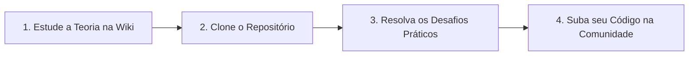

# Desbravando o Universo 

Seja muito bem-vindo! 🚀

Este repositório foi totalmente estruturado para otimizar o seu aprendizado na linguagem Python através da prática constante. Aqui você encontrará exercícios de fixação, desafios de lógica e projetos reais de programação.

Este ecossistema foi desenvolvido para ser **Open Source**. Nele, você poderá:
* 📖 Estudar toda a fundamentação teórica direto na nossa [Wiki do Projeto](../../wiki).
* 🧪 Guardar suas próprias resoluções de exercícios dentro da pasta dedicada à [Comunidade](./03_Comunidade).
* 💡 Sugerir novas atividades acadêmicas ou relatar problemas abrindo uma nova [Issue](../../issues).
* 🛹 Acompanhar a evolução do projeto e tarefas pendentes em nosso [Kanban](../../projects).

---

## 🧭 1. Como Estudar por Aqui?

Para extrair o máximo de valor deste projeto, siga a esteira de aprendizado:

## 🗺️ 2. Navegação no Repositório

| Diretório Principal / Subpasta | Descrição |
| :--- | :--- |
| 📁 **[01_Fundamentos_Desafios](./01_Fundamentos_Desafios)** | O coração do aprendizado (Exercícios práticos em código) |
| └── 📁 `0_SintaxeBasica/` | Variáveis, tipos de dados e operadores básicos |
| └── 📁 `1_Estruturas_Controle/` | Tomadas de decisão (if/else) e laços de repetição (for/while) |
| └── 📁 `2_Funcoes/` | Modularização, escopo e boas práticas com funções |
| └── 📁 `3_POO/` | Programação Orientada a Objetos aplicada ao mundo real |
| 📁 **[02_Projetos_Praticos](./02_Projetos_Praticos)** | Projetos reais que integram múltiplos conceitos da linguagem |
| 📁 **[03_Comunidade](./03_Comunidade)** | O seu laboratório pessoal e o espaço do novos devs |

> 💡 **Observação:** Os exercícios de fundamentos e os desafios possuem uma **dificuldade progressiva**, preparando você de forma sólida para encarar os projetos práticos. Se precisar de suporte teórico antes de codar, acesse o nosso [Portal de Estudos na Wiki](../../wiki).

## 🤝 3. Como Contribuir (Comunidade Open Source)

Este é um ambiente seguro, colaborativo e feito para quem quer aprender na prática ou construir portfólio. Veja como interagir com o ecossistema:

| Ferramenta / Ação | Como Funciona? | Objetivo / Utilização |
| :---: | :--- | :--- |
| **Issues Organizadas** | Use os nossos templates prontos na aba [Issues](../../issues). | Reportar bugs, sugerir melhorias de código ou propor novos exercícios para a trilha. |
| **Seu Espaço Dev** | Crie uma subpasta com o seu nome de usuário do GitHub dentro de `03_Comunidade/`. | Salvar seus gabaritos, scripts de estudo e códigos pessoais com total liberdade, sem riscos de conflitos. |
| **Pull Requests** | Faça um *Fork* do projeto, implemente suas melhorias e envie o pedido de integração. | Propor desafios inéditos, correções de sintaxe ou otimizações oficiais no core do projeto. |